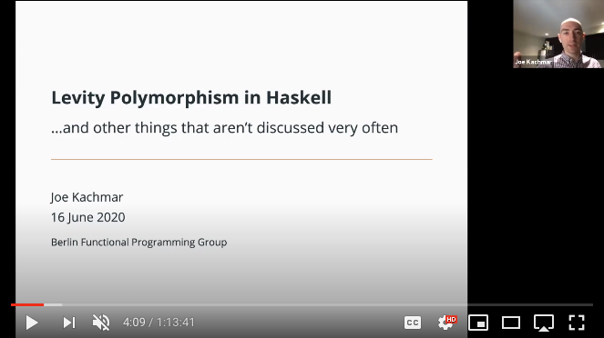

# Levity Polymorphism
## ...and other things that aren't discussed very often

# Presentation

A big thanks to [Steven Syrek](https://github.com/sjsyrek) for not only
organizing this presentation, as well as many more, and publishing them on
YouTube!

# Quickstart

A compiled copy of these slides can be found [here](./slides.pdf).

## Building with Nix

All of the dependencies required to build this project are provided in the
[shell.nix](./shell.nix) file; additionally, the included [.envrc](./.envrc)
can be used alongside [`lorri`](https://github.com/target/lorri/) to make the
loading/unloading of the `nix-shell` seamless.

1. Clone this repository to some directory and `cd` into it
2. Run `nix-shell --command 'make slides'`
  * This will likely take some time on the first run, as it may have to
  download LaTeX, `pandoc`, and other dependencies

That's it! The local `slides.pdf` file should now be updated with the latest
artifact.
